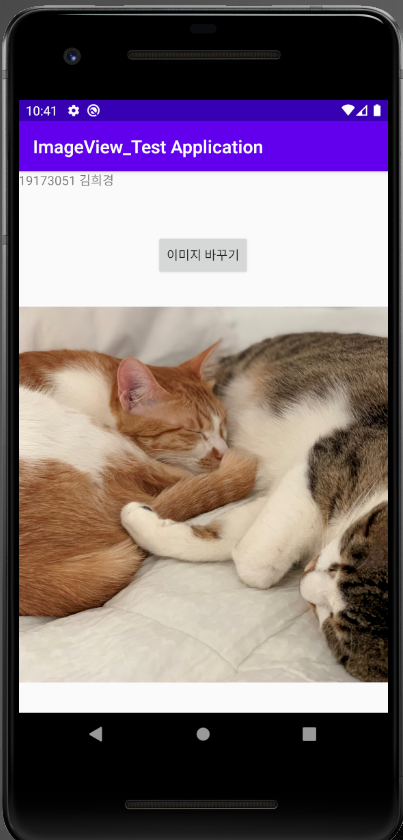
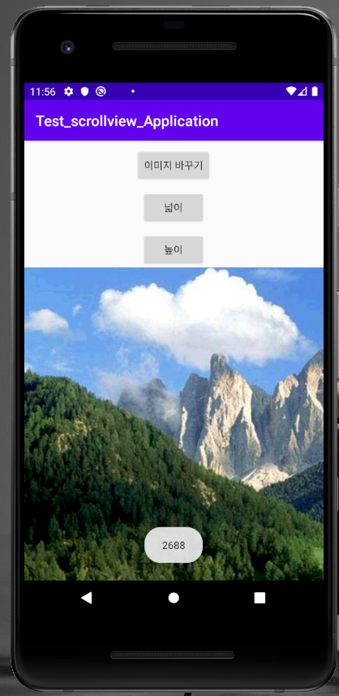
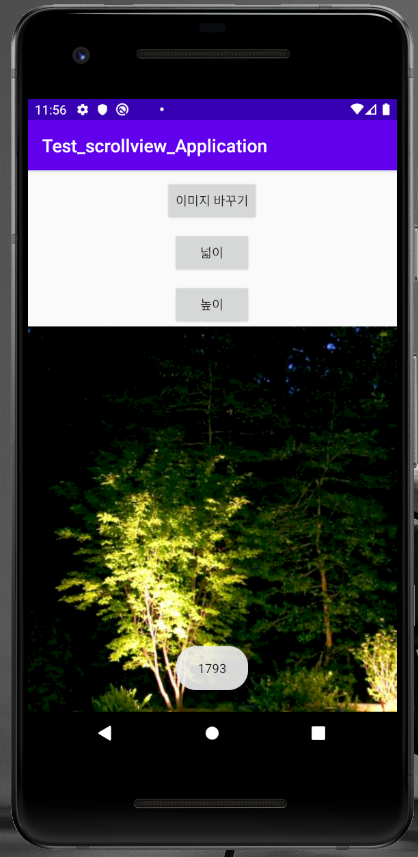

# 19173051 김희경

## 1주차 과제

## 2주차 과제
</img>

## 3주차 과제
</img>
</img>

## 4주차 과제
  -아이디어 명: 아낌없이 주는 나무
  
  -알람 및 나무 키우기 응용 애플리케이션으로, 동기부여를 위해 나무가 다 성장하면 포인트를 지급합니다. 5,000 포인트 이상이 되면 모바일 쿠폰을 구매하거나 돈으로 환급하여 본인 명의 통장에 입금할 수 있습니다. 사용자들은 알람이 울리면 나무에 물을 주거나 영양제를 주며 보살핌으로써 알람을 끌 수 있으며, 키울 나무를 직접 선택함으로써 나무에 대해 알아갈 수 기회가 될 것입니다. 사용자들은 앱에서 제공하는 이미지를 통해 심고자 하는 위치를 직접 선택할 수 있으며, 회사 측에서는 전 세계적으로 나무가 필요한 지역 탐방을 통해 주기적으로 업그레이드를 할 것입니다. 이러한 앱을 통해 나무에 대해 알고 직접 키우며 지구에 도움을 주는 일석이조로 이용자는 보람과 기쁨을 동시에 느낄 수 있을 겁니다.

## 7주차 과제
</img>
</img>

## 9주차 과제
</img>
</img>
</img>
</img>

## 10주차 과제
</img>
